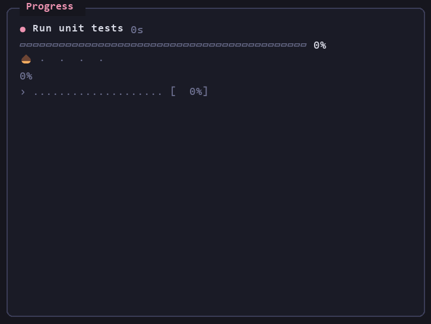

# AI Agent Skills

My reusable Agent Skills for Claude Code, Codex, and GitHub Copilot.

Each skill lives under skills/<skill-name>/SKILL.md.

Install all skills with:

npx skills add jkhaynes/ai-agent-skills --skill '*' --global --agent claude-code --agent codex --agent github-copilot --copy --yes

## Skills

- [branch-review](skills/branch-review/SKILL.md): senior-engineer review of the current branch before a PR, with required fixes and optional improvements.
- [new-project](skills/new-project/SKILL.md): starts a new project from my Spec Kit template and drafts its PRD, stack, docs and first spec.
- [phase-done](skills/phase-done/SKILL.md): closes out a finished Spec Kit phase: tasks, tests, stale references, state and one commit.
- [record-demo](skills/record-demo/SKILL.md): records a narrated, subtitled 1080p demo video of any web app with Playwright, an AI voiceover and ffmpeg, from a storyboard you sign off. Each shot is filmed by a subagent on a model you choose.
- [review-remediation](skills/review-remediation/SKILL.md): turns branch-review findings into ordered remediation tasks in `tasks.md`.
- [ship](skills/ship/SKILL.md): commits, pushes, opens the PR, waits for CI, merges and cleans up after one approval.

## Mods

Claude Code-only plugins (function hooks: panes, bands, toasts) live under mods/<mod-name>/. They aren't installed by `npx skills`; each mod's README says how to load it.

- [job-progress](mods/job-progress/README.md): live Progress pane for long-running test, scenario and batch jobs, with a pink bar and a plant that blooms or wilts.
- [spec-resume](mods/spec-resume/README.md): after startup or `/clear` in one of my Spec Kit repos (GitHub owner allowlist), tells Claude the branch, current spec and phase, unchecked tasks, open PRs and `docs/state.md` focus. Pairs with the `phase-done` skill.

