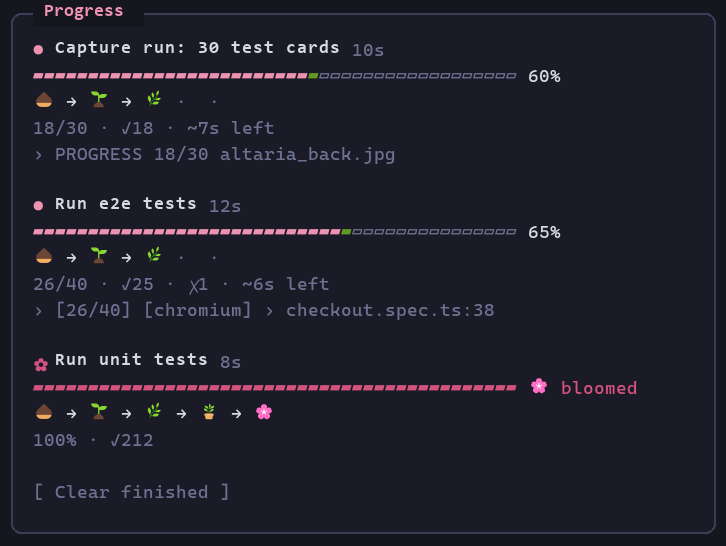
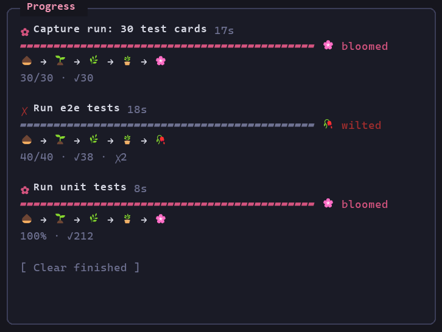

# job-progress

A Claude Code mod that shows a live **Progress** pane for long-running jobs Claude runs: unit, integration and e2e test suites, scenario/eval runs, batch runs such as test images through a capture pipeline.

Each job gets a soft pink bar with a green growing tip, a plant that grows as the job runs, pass/fail counts, elapsed time, an ETA and the latest output line. When the job ends it either **blooms** or **wilts**:


<sub>Three demo jobs over 20 seconds: the unit tests bloom, the e2e suite wilts after two failures, and a capture run of 30 test cards blooms. The frames come from the mod's own render hook on the terminal surface, mounted with `claude plugin test` and fed demo job states, then painted in Cascadia Mono. They show what the pane draws, but they aren't a screen recording.</sub>

| Running | Finished |
| --- | --- |
|  |  |

A toast says "🌸 … bloomed" or "🥀 … wilted" when a job finishes. To remove finished jobs, run `/progress clear`, which works everywhere. Clicking **Clear finished** works in the desktop app and the fullscreen terminal. In the regular terminal, the button only responds to the `c` key while the pane has focus.

`/progress` toggles the pane. To close it you can also:
- run `/progress close`
- press Esc at an empty prompt
- click **Close**, or press `x` while the pane has focus

The pane opens again on its own when the next background job starts.

Dev servers (`npm run dev:e2e`, `bench:serve`, `vite`, `wrangler dev`, `uvicorn`) get their own rows at the top: 🌿, the port when the command or output names one, and uptime. They have no bar and never bloom or wilt. To stop them from any terminal, run `/progress stop` (all servers) or `/progress stop 2` (the second row). Each row also has a **Stop** button, which in the regular terminal answers `1`, `2`, … while the pane has focus.

Stopping a server kills its whole process tree, not just its task. On Windows, `TaskStop` alone leaves an npm-launched server running. Git Bash starts each program through a helper process that exits, so no Windows parent link reaches the server, and the stop only kills the outer shell. The mod marks each background server's command with `JOB_PROGRESS_TAG`. To stop a server, it finds the marked shell, kills every process in that shell's Git Bash process group with `taskkill /T /F`, and only then calls `TaskStop`. It reports a stop only when none of the group is left. A server started before this marking existed gets a warning instead of "Stopped". This happens on every `TaskStop`, including when you just ask Claude to stop a server. The mod handles `TaskStop` itself, kills the marked tree first, then updates the pane. A `TaskStop` raises no task notification, so without this the pane would never hear about the stop. Stopping a job that isn't a server marks its row as stopped, with no bloom or wilt.

A runner only counts when it's the program a step of the command runs. Quoted text is ignored, and the start of each `&&`, `;`, `|` or loop step is checked. A command that only mentions one (`-notmatch 'playwright|vitest'`, `cat vitest.config.ts`) is left alone.

Every running job shows a bar from the start, at 0% until its output gives a count or percentage. A job that finishes without ever giving a count, percentage or pass/fail numbers gets one line with ✓ or ✗ instead of a full bar and a bloom. If it finishes in under 30 seconds, it's removed without a toast. Bars are at most 40 columns wide.

### Tuned for my projects

This copy is set up for my own repos rather than general use:

- **Followed in the background:** PokeJudge `dotnet run … evaluate`, ten-or-not `attacks.py` / `tuning_report.py` / `make_e2e_fixtures.py` / `click_measure.py`, `gh run watch`, `gh pr checks --watch` and `timeout N … wrangler tail`.
- **No sleep-waiting:** while a job (not a server) is running, a foreground `sleep` of 60 seconds or more is refused. The refusal tells Claude it will be notified when the job ends. Claude is also told not to redirect a background job into a log file of its own, since the pane can't see that file.
- **Output it understands:** PokeJudge `Result: 13/20 scenarios fully passed` counts as 13 passed and 7 failed. ten-or-not `165 cases  2 WRONG` lines count as passed/failed. Card numbers (`096/182`) and centering ratios (`42/58`) aren't progress. `0.85 failed` (a reading) and `attempt 1 failed` (a retry) aren't failures.

## How it works

| Piece | What it does |
| --- | --- |
| `tool.call` (Bash, PowerShell) | Remembers each shell call's description as the job's label. Moves known test runners (vitest, jest, Playwright, pytest, `dotnet test`, `go test`, `cargo test`, `npm/pnpm/yarn/bun test·e2e·bench`) and my project runs to the background when the call didn't choose. Refuses a long `sleep` while a job runs. The rules live in `hooks/classify.ts`. |
| `session.append` | Picks up a job from the shell result row ("running in background with ID: X. Output is being written to: P") and marks it finished from its `<task-notification>` row. |
| `$.clock.every(1500)` | Re-reads each running job's output file when it grows and parses progress from it. |
| `tool.describe` | Adds a line to the Bash/PowerShell tool descriptions asking Claude to background long jobs and to print `PROGRESS <done>/<total> <item>` lines from scripts it writes. |
| `ui.render` (Pane) | Draws the pane. `/progress` opens or closes it on demand. |

Only background jobs are tracked: a foreground command's output isn't visible until it ends.

### Progress parsing (`hooks/parse.ts`)

In order of preference:

1. `PROGRESS 3/10 label` lines: the convention for custom scripts.
2. `[12/40]` counters (Playwright list reporter).
3. A bare `n/m`.
4. A percentage, plus a planned total from `Running 40 tests` / `collected 40 items`.

Pass/fail counts come from runner summaries (`88 passed`, `3 failed`, `Passed: 41`, `Failed: 1`), or from per-test marks (✓ ✗ PASS FAIL ok / not ok) while a run is still going.

## Install

The mod is a plugin folder. Load it in any session with:

```bash
claude --plugin-dir <path-to>/ai-agent-skills/mods/job-progress
```

To load it in every session (including the desktop app), add the folder to `CLAUDE_CODE_PLUGIN_DIRS` in the `env` block of `~/.claude/settings.json`:

```json
{
  "env": {
    "CLAUDE_CODE_PLUGIN_DIRS": "<path-to>/ai-agent-skills/mods/job-progress"
  }
}
```

## Develop

```bash
claude plugin validate mods/job-progress
node mods/job-progress/hooks/parse.check.mts
node mods/job-progress/hooks/classify.check.mts
node mods/job-progress/hooks/followed.check.mts
claude plugin test mods/job-progress
```

`parse.check.mts`, `classify.check.mts` and `followed.check.mts` are plain Node self-checks for the parser and the command rules (Node 22+ runs the TypeScript import directly). The parser checks use real output lines from my projects. `hooks/tool-call.test.ts` and `hooks/my-runs.test.ts` check the shell-call rewrite (backgrounding, dropping tail/head pipes, `PYTHONUNBUFFERED`), and `hooks/pane.test.ts` checks `/progress` opening and closing the pane, all under `claude plugin test`.

Gotcha found while building it: inside a `Text`, use arrays of `Text` children, not fragments (`<>…</>`). A fragment there is refused as "Box inside an inline element", and the engine draws an empty pane instead.

## Limits

- Output files over 4 MiB stop updating (the `$.fs.read` cap); the pane keeps the last reading.
- Auto-backgrounding applies to quick unit test runs too, so Claude waits for the completion notice instead of reading output inline. Remove the `RUNNER` rewrite in `hooks/register.tsx` if that gets in the way.
- Labels are kept in module memory, so a job started just before a mod reload shows as "Background job".
- A job piped through `| tail -N` or `| head -N` shows no progress until it ends. The mod drops a trailing tail/head pipe from commands it backgrounds and asks Claude not to add one, but other filters (`| grep …`) still hide progress.
- Python buffers output written to a file; scripts should run with `python -u` (or flush) for live `PROGRESS` lines.
